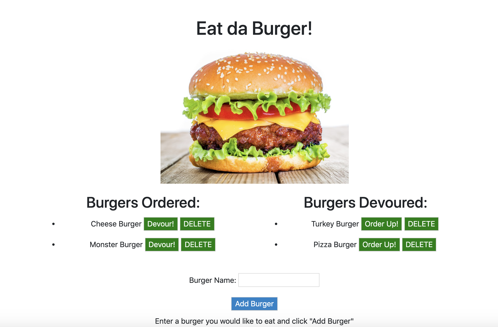

# Eat da Burger!
## Description and Usage
Hungry? The Eat da Burger application allows the user to pick the type of burger they would like to eat. 

The user will type the name or description of the burger they are hungry for in the textbox and click "Add Burger". Upon clicking the "Add Burger" button the burger will appear in the "Burgers Ordered" section where the user can either devour the burger or delete it from their order. If the user decides to devour a burger it will then appear in the "Burgers Devoured" section where they will have the choice to either order the burger again by clicking the "Order Up!" button or delete it forever by clicking the "Delete" button.

Does this sound delicious to you?

[Click here to try 'Eat da Burger'!](https://agile-meadow-66473.herokuapp.com/)

## Technology
* HTML
* CSS
* Bootstrap
* Handlebars
* JavaScript
* Node.js
* Express
* MySQL
* ORM
* MVC design pattern

  
## What I Learned
I learned many new concepts and skills while creating the Eat da Burger application. A few of which include:
* The purpose of Handlebar views and layouts
* How partials (partial layouts) can be used
* Object-Relational Mapping and how it all connects
* Proper folder structure to ensure all files know where to find each other
* Callbacks
* MVC (Model, View, Controller)
* Deploying to Heroku
